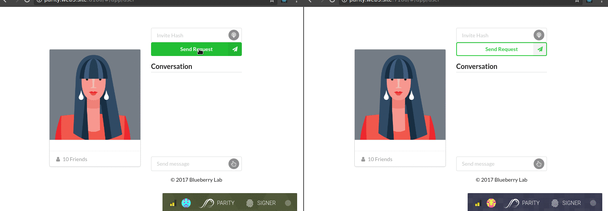

# DSCL

## Decentralized Socket Connection Lobby

It's actually a webRTC handshake lobby contract, but the name kinda stuck while we were focusing on implementing the function, so we decided to let it be and publish it `¯\_(ツ)_/¯`

Maybe some folk might come over and correct us. That'd be cool!

## How does it works?

It is a dapps written in Solidity running on top of the Ethereum block chain that negotiate webRTC handshake request using the following flow:
+ Alice initiate an invite by generating a Diffie Helman key gA
+ Alice call the DSCL contract passing in gA and Bob's address

+ Bob upon receives the request, will host a WebRTC session, generating webRTC invite token tB.
+ Bob generates his key gB. With gA and gB, he encrypts tB into etB.
+ Bob then store etB into ipfs and receives a portable multihash mhB
+ Bob call the DSCL contract passing in gB, mhB and Alice's address.

+ Alice with mhB retrieve the encrypted session token etB. with gA and gB, she decrypt it for tB.
+ Alice generate her webrtc answer token tA using Bob's invite token tB.
+ Alice encrypts tA into etA with gA and gB
+ Alice store etA into ipfs and receives mhA
+ Alice call the DSCL contract again, passing in mhA and B's address.

+ Bob using the mhA key to retrieve the encrypted etA from ipfs
+ Bob decrypt etA with gA and gB for the accept token tA

Alice and Bob are now connected via webRTC.

## How do I run this?

First you will need to setup [parity](https://parity.io). Once that's done, you will need to setup some configuration for development. Here are two config files I used for the Kovan test net:

Config 1, stored in `path/to/kovan1.toml`
```
[parity]
# Kovan Test Network
chain = "kovan"

[ui]
port = 7180

[network]
port = 20202

[rpc]
port = 7545

[websockets]
port = 7080
interface = "local"
hosts = ["none"]

[dapps]
disable = false
path = "path/to/parity/dapps"

```

Config 2: `path/to/kovan2.toml`
```
[parity]
# Kovan Test Network
chain = "kovan"

[websockets]
port = 8080
interface = "local"
hosts = ["none"]

[dapps]
disable = false
path = "path/to/parity/dapps" # set this to any path you want

```

These two configs will allow you to run 2 instances of the dapps on two separate ports to test. Run them like this:

```
parity --config path/to/kovan1.toml
```

```
parity --config path/to/kovan2.toml
```

Now link the project path to the dapps path of Parity:

```sh
ln -s path/to/parity/dapps path/to/dscl
```

Within the project, run:
```
npm i;
npm run watch;
```

You might have to restart parity. But once you see DSCL in the Application tab, you are good to go!

The following gif demonstrate how this app looks:


## NOTE

Demo gif is using a copy/paste version due to Parity local is not running on HTTPS, thus webCrypto basically stop support that couple months ago `¯\_(ツ)_/¯`

## LICENSE

Copyright (C) 2017 lab

This program is free software: you can redistribute it and/or modify
it under the terms of the GNU General Public License as published by
the Free Software Foundation, either version 3 of the License, or
(at your option) any later version.

This program is distributed in the hope that it will be useful,
but WITHOUT ANY WARRANTY; without even the implied warranty of
MERCHANTABILITY or FITNESS FOR A PARTICULAR PURPOSE.  See the
GNU General Public License for more details.

You should have received a copy of the GNU General Public License
along with this program.  If not, see <http://www.gnu.org/licenses/>.
